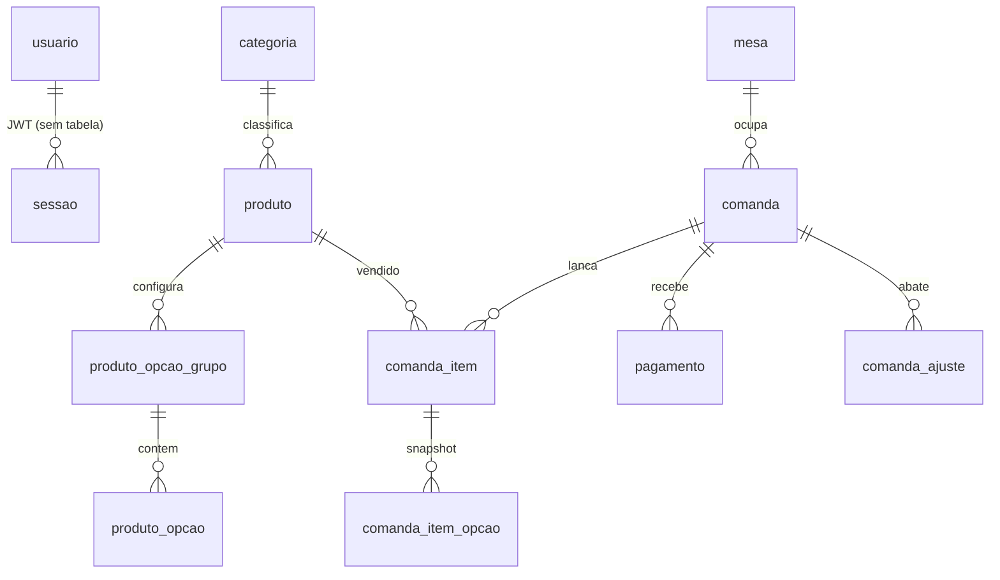

# 1. Análise do Sistema Atual

## 1.1 Retrato em uma frase

Monólito de 3 camadas bem separadas, ~2.800 linhas de código próprio, escrito com disciplina
acima da média para um projeto pessoal: totais calculados só no servidor, preços congelados no
lançamento, histórico imutável. O que falta não é organização — é **rede de proteção**
(testes, migrations, papéis de acesso, fuso horário) e **dados de custo**.

## 1.2 Stack verificada

| Camada | Tecnologia | Evidência |
|---|---|---|
| Front | React 19.2 + Vite 7.3, react-router 7.18, recharts 3.9, jsPDF 4.2, lucide-react | `front-end/package.json` |
| API | .NET 10 (`net10.0`), ASP.NET Core Controllers, Dapper 2.1.79, Npgsql 10.0.3, BCrypt.Net-Next 4.2, JwtBearer 10.0.9 | `back-end/MenuRestaurante.Api.csproj` |
| Banco | PostgreSQL, schema criado por script SQL manual | `banco-de-dados/01_criacao.sql` |
| Integração | Vite proxy `/api` → `http://localhost:5263` | `front-end/vite.config.js:11` |

Sem Docker, sem CI, sem projeto de testes, sem ORM com migrations.

## 1.3 Arquitetura em camadas

```
React (páginas)  →  api.js (fetch + JWT)  →  Controllers  →  Serviços  →  Repositórios  →  Postgres
                                              (HTTP)        (regras)     (Dapper/SQL)
```

**O que está certo aqui:** a separação é real, não decorativa.

- `Controllers/` não contém regra de negócio — só roteia e devolve `Ok(...)`.
  Ex.: `ComandasController.cs` inteiro são 83 linhas de delegação.
- `Servicos/ComandaServico.cs` concentra **toda** a aritmética financeira.
  `MontarDetalhe` (`ComandaServico.cs:236-273`) é o único lugar que calcula total,
  taxa, pago e restante. O navegador nunca envia valor — só `produtoId` e `quantidade`.
- `Repositorios/` só fala SQL. `FabricaConexao` centraliza a connection string.
- Erro de regra vira 400 com mensagem em português por um middleware único
  (`Program.cs:52-63`) — o front não precisa traduzir código de erro.

**Injeção de dependência:** tudo registrado em `Program.cs:15-22`. `FabricaConexao` é
Singleton (correto — só guarda string), o resto é Scoped.

## 1.4 Modelo de dados



### Decisões de modelagem que já estão corretas

1. **Comanda é o agregado de movimento.** Mesa e balcão são o mesmo objeto com `tipo`
   diferente. Comanda `FECHADA` nunca é apagada — é o registro de faturamento
   (`01_criacao.sql:70-82`). Não existe tabela de "registro diário": o histórico é derivado.
2. **Preço congelado.** `comanda_item.preco_unitario` guarda o preço do momento; mudar o
   cardápio não reescreve venda antiga (`01_criacao.sql:96`).
3. **Snapshot de opções.** `comanda_item_opcao` guarda **nome** do grupo e da opção, não FK.
   Renomear "Molho Turco" amanhã não corrompe a venda de ontem (`01_criacao.sql:102-108`).
4. **Índice único parcial** garante no banco no máximo uma comanda aberta por mesa
   (`01_criacao.sql:85-87`) — a regra não depende só do C#.
5. **Exclusão lógica com critério.** Produto com histórico é desativado; sem histórico é
   apagado de verdade (`CatalogoRepositorio.cs:123-132`). Mesa idem (`mesa.ativa`).
6. **Advisory lock** em `pg_advisory_xact_lock(20260702)` serializa criação/exclusão de
   mesa (`ComandaRepositorio.cs:177, 194`) — cuidado que a maioria dos projetos não tem.

### Onde o modelo vai doer nas próximas features

| Lacuna | Consequência |
|---|---|
| `produto` não tem custo, unidade de medida, SKU, código de barras | Sem CMV não existe margem; sem unidade não existe baixa de estoque |
| `produto` não tem NCM, CEST, CFOP, origem, CST/CSOSN | Campos **obrigatórios** na NF-e/NFC-e — sem eles a SEFAZ rejeita |
| Não existe entidade "empresa/emitente" (CNPJ, IE, endereço, regime) | Nota fiscal precisa do emitente; hoje o dado não existe em lugar nenhum |
| Não existe cliente/destinatário (CPF/CNPJ) | NFC-e exige CPF; NF-e exige CNPJ |
| Não existe insumo nem ficha técnica | Esfiha vendida não sabe descontar farinha, carne e embalagem |
| `comanda_ajuste` mistura DESCONTO (abatimento comercial) e SANGRIA (retirada de caixa) na mesma tabela, ambos abatendo o restante da comanda | Sangria conceitualmente não pertence à comanda — pertence ao caixa. Distorce a leitura financeira |

## 1.5 Superfície da API (14 rotas de operação + 7 de relatório)

| Método | Rota | Origem |
|---|---|---|
| POST | `/api/autenticacao/login` \| `/cadastro` | `AutenticacaoController` |
| GET/POST/DELETE | `/api/mesas`, `/api/mesas/{n}` | `ComandasController` |
| POST | `/api/mesas/{n}/comanda` | idem |
| GET/POST/DELETE | `/api/balcao/pedidos`, `/api/comandas/{id}` | idem |
| POST/DELETE | `/api/comandas/{id}/itens[/{itemId}]` | idem |
| POST/DELETE | `/api/comandas/{id}/pagamentos[/{pagamentoId}]` | idem |
| POST/DELETE | `/api/comandas/{id}/ajustes[/{ajusteId}]` | idem |
| PUT | `/api/comandas/{id}/taxa-servico` | idem |
| POST | `/api/comandas/{id}/fechar` | idem |
| GET | `/api/categorias`, `/api/produtos` (+ POST/PUT/DELETE) | `CatalogoController` |
| GET | `/api/relatorios/{caixa-diario, vendas-por-semana, vendas-por-mes, produtos-mais-vendidos, formas-pagamento, ajustes-por-dia, taxa-nao-cobrada}` | `RelatoriosController` |
| GET | `/api/relatorios/resumo` | ⚠ `ComandasController.cs:82` — fora do controller de relatórios |

Todas as rotas exceto login/cadastro exigem `[Authorize]`.

## 1.6 Front-end

7 páginas (`Login`, `Frente`, `Mesas`, `Balcao`, `Comanda`, `Cardapio`, `Administrativo`),
8 componentes, 1 serviço HTTP. Estado local com `useState`/`useMemo` — sem Redux/Zustand/React
Query, o que é a escolha certa nessa escala.

Ponto alto: `Comanda.jsx:180-202` agrupa unidades iguais na exibição (3 esfihas viram "3x")
mas mantém pesagens separadas — cada pesagem é uma linha real no banco. UX de PDV correta.

Ponto alto 2: `api.js:68-71` — `dataPuraLocal` resolve o clássico bug de `new Date('2026-07-02')`
ser interpretado como UTC e voltar um dia.

---

# 2. Achados — ordenados por risco

## 🔴 Crítico

### C-1. Qualquer um cria conta com acesso total
`AutenticacaoController.cs:27-39` — `/api/autenticacao/cadastro` é `[AllowAnonymous]` e não
tem convite, aprovação ou papel. Quem alcançar a API cria usuário e passa a ver faturamento,
alterar cardápio e fechar comanda. Não existe RBAC: `Usuario` não tem coluna de papel e nenhum
endpoint distingue dono de garçom.

**Piora com o que você vai construir:** emitir nota fiscal é ato jurídico em nome do CNPJ.
Estoque tem ajuste manual (a porta dos fundos de qualquer desvio). Ambos precisam de papel.

### C-2. Fuso horário do "caixa do dia" não está fixado
Todo o corte de dia usa `CURRENT_DATE` / `pago_em::date` do Postgres
(`ComandaRepositorio.cs:298`, `RelatorioRepositorio.cs:20-30, 79-87`). `pago_em` é `TIMESTAMPTZ`,
então `::date` converte usando o `TimeZone` **da sessão**, que herda do servidor. Se o Postgres
estiver em UTC (padrão de container e de nuvem), o caixa vira às **21h de Brasília** — jantar de
sexta cai no sábado.

Hoje pode estar certo por acaso (Postgres local em `America/Sao_Paulo`). Vira erro silencioso no
dia em que o banco sair da máquina. Com nota fiscal, data errada é problema fiscal, não estético.

### C-3. Zero testes automatizados
Não existe projeto de teste no repositório. Toda a aritmética financeira
(`ComandaServico.MontarDetalhe`) está sem rede. Antes de acrescentar dois módulos que mexem em
dinheiro e em obrigação legal, isso é o risco número um.

## 🟠 Alto

### A-1. `appsettings.example.json` não existe
`.gitignore:57-61` ignora `appsettings.json` e faz `!back-end/appsettings.example.json` —
mas **o arquivo de exemplo não está no repositório** (verificado). Consequência: clonar o
projeto e rodar não funciona, e `Program.cs:36` usa `builder.Configuration["Jwt:Chave"]!` —
se a chave faltar, o startup morre com `NullReferenceException` sem dizer o que falta.

### A-2. Corrida em `AdicionarPagamento` permite pagar mais que o devido
`ComandaServico.cs:107-123`: lê `detalhe.Restante`, compara, e só depois insere — sem transação
nem lock. Dois tablets registrando o pagamento da mesma mesa ao mesmo tempo passam os dois pela
validação. Resultado: `pago > totalDevido`, caixa do dia inflado.

O mesmo padrão leitura-depois-escrita está em `AdicionarAjuste` (`:138-154`) e em `Fechar` (`:196-210`).

### A-3. Abrir comanda de mesa em corrida devolve 500
`ComandaServico.cs:29-30` faz `BuscarAbertaDaMesa` e depois `AbrirComandaMesa`. Dois toques
simultâneos na mesma mesa → o índice único `ux_comanda_mesa_aberta` estoura como exceção não
tratada (500 com stack), não como mensagem amigável. Correção: `ON CONFLICT DO NOTHING` +
re-leitura, ou capturar `PostgresException` `23505`.

### A-4. Schema sem versionamento
Três arquivos SQL soltos (`00_banco`, `01_criacao`, `02_populacao`, `03_atualizacao_ajustes`) —
a numeração já pulou o `02` de schema, e não há tabela registrando o que foi aplicado. Estoque +
fiscal vão somar 10+ tabelas e várias alterações. Sem migration versionada, atualizar o banco
do restaurante em produção vira operação manual de risco.

### A-5. Sem log estruturado e sem observabilidade
O middleware de `Program.cs:52-63` trata `RegraDeNegocioException`; qualquer outra exceção sobe
como 500 sem log configurado. Para integração fiscal — onde a falha típica é "SEFAZ rejeitou com
código 539" — isso é inaceitável: você precisa do rastro da requisição, do payload e da resposta.

## 🟡 Médio

| # | Achado | Local |
|---|---|---|
| M-1 | Sem rate limiting no login → força bruta livre | `AutenticacaoController.cs:13` |
| M-2 | Senha sem política no servidor (`minLength=4` só no HTML) | `Login.jsx:135` vs `AutenticacaoController.cs:35` |
| M-3 | Token JWT de 12h em `localStorage`, sem refresh e sem revogação | `api.js:6-9`, `TokenServico.cs:16` |
| M-4 | `estaLogado()` só checa presença do token, não expiração — usuário navega e leva 401 na cara | `api.js:24-26` |
| M-5 | CORS fixo em `http://localhost:5173` — deploy quebra | `Program.cs:44` |
| M-6 | Sem índices em `pagamento(pago_em)`, `comanda(fechada_em)`, `comanda(status, tipo)` — todo relatório varre a tabela | `01_criacao.sql` |
| M-7 | `MontarDetalhe` roda 4 consultas e é chamado 2× por operação de pagamento/ajuste (≈8 idas ao banco por clique) | `ComandaServico.cs:115, 122` |
| M-8 | `relatorios/resumo` mora em `ComandasController`, fora do controller de relatórios | `ComandasController.cs:82` |
| M-9 | Sem HTTPS redirect e sem HSTS | `Program.cs` |
| M-10 | `window.location.href = '/login'` no 401 faz reload completo, perdendo estado do SPA | `api.js:38` |

## ✅ O que não mexer

- Cálculo de total só no servidor.
- Congelamento de preço e snapshot de opções.
- Comanda fechada imutável.
- Índice único parcial de comanda aberta por mesa.
- Advisory lock na manutenção de mesas.
- Middleware único de erro de negócio.
- Nomenclatura em português consistente do banco ao componente React.

Essas decisões são o alicerce do que vem a seguir. Os módulos novos devem herdá-las, não
inventar convenção paralela.
