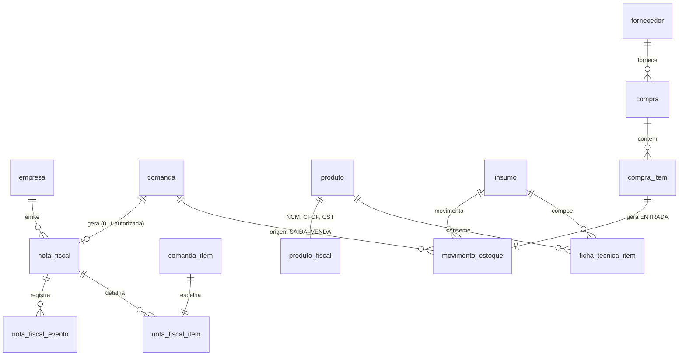

# Architecture Spine

Fixa apenas os **invariantes** — as decisões que, se duas partes do sistema resolverem
sozinhas, divergem. Tudo que é estrutura óbvia (árvore de pastas, nome de classe) fica com
o código.

## Paradigma

**Livro-razão imutável sobre agregados transacionais, com camada de serviço fina.**
Continua o que o código já faz — comanda fechada não muda, preço congelado, opção em snapshot.
Estoque e nota fiscal são a mesma ideia levada adiante: **fatos passados não se editam,
corrigem-se com novos fatos.**

## Invariantes herdados (do código existente — vinculantes, não redecidir)

| ID | Regra já vigente | Onde |
|---|---|---|
| H-1 | Todo valor monetário é calculado no servidor. O cliente nunca envia total | `ComandaServico.MontarDetalhe` |
| H-2 | Preço e nome de opção são congelados no lançamento | `comanda_item.preco_unitario`, `comanda_item_opcao` |
| H-3 | Comanda `FECHADA` é registro de faturamento e nunca é apagada | `01_criacao.sql:70` |
| H-4 | Erro de regra vira 400 com mensagem em português via `RegraDeNegocioException` | `Program.cs:52-63` |
| H-5 | Controller não tem regra; serviço tem regra; repositório só tem SQL | camadas atuais |
| H-6 | Nomenclatura em português, `snake_case` no banco → `PascalCase` no C# via Dapper | `Program.cs:11` |

Os módulos novos **herdam** isso. Não criar padrão paralelo.

---

## Decisões de arquitetura

### AD-01 — Papel do usuário é invariante de autorização, não regra de tela
- **Vincula:** toda rota nova de estoque, fiscal, custo e relatório financeiro.
- **Previne:** cada módulo inventar seu próprio controle ("só o dono vê custo" implementado
  escondendo botão no React).
- **Regra:** `usuario.papel ∈ {DONO, OPERADOR}`, claim no JWT, `[Authorize(Roles = "DONO")]`
  no controller. O front esconde botão por conveniência; a API **sempre** valida.
  `/api/autenticacao/cadastro` deixa de ser anônimo.

### AD-02 — Fuso horário do negócio é fixado na aplicação, não herdado do servidor
- **Vincula:** todo corte de dia, relatório e competência fiscal.
- **Previne:** caixa virando às 21h porque o Postgres subiu em UTC (achado C-2).
- **Regra:** existe uma constante única `America/Sao_Paulo`. Toda consulta que corta por dia usa
  `(pago_em AT TIME ZONE 'America/Sao_Paulo')::date`, nunca `pago_em::date` puro. Nenhum
  `CURRENT_DATE` nu em SQL de relatório.

### AD-03 — Estoque é livro-razão, nunca coluna de saldo
- **Vincula:** entrada, venda, ajuste, perda, inventário, e qualquer leitura de saldo.
- **Previne:** dois caminhos gravando `produto.quantidade` e divergindo; perda da auditoria de
  "por que o saldo mudou".
- **Regra:** `movimento_estoque` é append-only. Saldo = `SUM(quantidade)` do livro (com view
  materializada ou tabela de saldo derivada **reconstruível** se o desempenho exigir).
  Nunca existe `UPDATE` de quantidade. Correção é lançamento novo com tipo `AJUSTE`.

### AD-04 — A baixa de estoque acontece no fechamento da comanda, dentro da mesma transação
- **Vincula:** `ComandaServico.Fechar` e todo o módulo de estoque.
- **Previne:** estoque baixado por item lançado e depois removido; pedido de balcão excluído
  deixando baixa órfã; baixa parcial se o processo cair no meio.
- **Regra:** fechar comanda e gravar os `SAIDA_VENDA` correspondentes é **uma transação**.
  Se a baixa falhar, a comanda não fecha. `movimento_estoque` guarda `comanda_id` — a origem de
  toda saída de venda é rastreável até a comanda.

### AD-05 — Ficha técnica é resolvida e congelada no momento da baixa
- **Vincula:** ficha técnica, custo, relatórios de CMV.
- **Previne:** mudar a receita da esfiha em outubro e o CMV de agosto mudar junto.
- **Regra:** ao gerar `SAIDA_VENDA`, gravar a quantidade **e o custo médio vigente naquele
  instante** no próprio lançamento. Igual ao H-2, um nível abaixo. Relatório histórico lê o
  lançamento, nunca recalcula a partir da ficha atual.

### AD-06 — Falta de estoque alerta, não bloqueia
- **Vincula:** lançamento de item e fechamento de comanda.
- **Previne:** o sistema impedir uma venda real porque o cadastro está desatualizado — a maneira
  mais rápida de fazer seus pais abandonarem o módulo.
- **Regra:** saldo negativo é estado válido. Gera sinalização visual e entra no relatório de
  divergência. Nunca lança `RegraDeNegocioException`.

### AD-07 — O provedor fiscal fica atrás de uma interface própria
- **Vincula:** todo o módulo fiscal.
- **Previne:** o modelo de dados e os serviços se moldarem ao JSON da Focus/Brasil NFe, e a troca
  de fornecedor virar reescrita. Fornecedor de nota fiscal muda — a Nuvem Fiscal encerrou em
  31/07/2026 e quem estava acoplado pagou a conta.
- **Regra:** existe `IProvedorFiscal` com contrato em termos do **domínio**
  (`Emitir(NotaFiscal)`, `ConsultarStatus(chave)`, `Cancelar(chave, justificativa)`), retornando
  tipos do domínio. Nenhum tipo do SDK do fornecedor atravessa a camada de serviço. Uma
  implementação por provedor; a escolha é configuração.

### AD-08 — A nota fiscal é um agregado próprio, com máquina de estados, não um campo na comanda
- **Vincula:** modelo de dados fiscal, fechamento de comanda, reprocessamento.
- **Previne:** `comanda.nota_autorizada = true` — que não sabe representar rejeitada,
  em processamento, cancelada, nem duas tentativas.
- **Regra:** tabela `nota_fiscal` referencia `comanda_id`, com
  `RASCUNHO → ENVIADA → AUTORIZADA | REJEITADA | DENEGADA`, e `AUTORIZADA → CANCELADA`.
  Toda transição vira linha em `nota_fiscal_evento` com código, mensagem e carimbo de tempo.
  **Índice único parcial** garante no máximo uma nota `AUTORIZADA` por comanda — o mesmo padrão
  que já protege a comanda aberta por mesa.

### AD-09 — Comunicação com o provedor é por polling, não webhook
- **Vincula:** o fluxo assíncrono da NF-e.
- **Previne:** depender de o sistema ter endereço público — ele roda na rede do restaurante.
  Expor a máquina do caixa à internet para receber webhook é risco desnecessário.
- **Regra:** NFC-e é síncrona e resolve na resposta. NF-e entra na fila e um serviço em background
  consulta o status com espera crescente até o desfecho. Se um dia houver host público, o webhook
  vira otimização, não pré-requisito.
- `[ADOPTED]` — confirmado em 2026-08-11: a operação começa em localhost (Q-6).

### AD-10 — Emissão é idempotente por comanda
- **Vincula:** todo caminho que dispara emissão (botão, retry automático, fila).
- **Previne:** nota duplicada — que na prática significa imposto pago duas vezes e cancelamento
  fora do prazo.
- **Regra:** a emissão carrega chave de idempotência derivada de `comanda_id`. Reenvio com a mesma
  chave devolve a nota existente. Só se pode gerar nova nota para uma comanda depois que a
  anterior estiver `REJEITADA` ou `CANCELADA`.

### AD-11 — Fechamento da comanda não depende da nota
- **Vincula:** `ComandaServico.Fechar`, UX do PDV.
- **Previne:** SEFAZ fora do ar travando o caixa do restaurante numa sexta à noite.
- **Regra:** fechar comanda e emitir nota são passos **separados**. Falha na emissão deixa a nota
  `REJEITADA`/pendente e a comanda fechada. Contraste deliberado com AD-04: estoque é dado
  interno e é transacional; nota depende de terceiro e não é.

### AD-12 — Segredo fiscal não mora no repositório nem no `appsettings.json`
- **Vincula:** certificado A1, token do provedor, CSC da NFC-e.
- **Previne:** o `.pfx` do CNPJ dos seus pais num commit — do qual não se volta atrás; a chave
  fica comprometida para sempre e o certificado precisa ser revogado e recomprado.
- **Regra:** o `.pfx` fica no painel do provedor sempre que possível. Token e CSC vêm de variável
  de ambiente ou User Secrets. `appsettings.example.json` entra no repositório com os nomes das
  chaves e valores vazios — nunca valores reais.

### AD-13 — Schema muda por migration versionada
- **Vincula:** as ~10 tabelas novas e toda alteração futura.
- **Previne:** o que já está começando — `03_atualizacao_ajustes.sql` cheio de `IF NOT EXISTS`
  porque ninguém sabe o que foi aplicado onde.
- **Regra:** ferramenta de migration com tabela de controle (DbUp é o caminho de menor atrito para
  um projeto Dapper — mantém SQL puro, só acrescenta o registro do que rodou). Os scripts atuais
  viram a migration inicial. Nenhum SQL de schema roda à mão em produção.

### AD-14 — Toda regra de dinheiro tem teste antes de ganhar dependente
- **Vincula:** cálculo de comanda, custo médio, baixa de estoque, montagem da nota.
- **Previne:** construir dois módulos financeiros sobre um núcleo sem nenhuma verificação
  automática (achado C-3).
- **Regra:** projeto `MenuRestaurante.Testes` com xUnit. `ComandaServico` ganha testes **antes**
  de a Fase 2 começar. Custo médio ponderado e baixa de estoque nascem com teste no mesmo commit.

---

## Modelo de dados novo



## Fluxo do fechamento

```mermaid
sequenceDiagram
    participant PDV as Comanda (React)
    participant API as ComandaServico
    participant EST as EstoqueServico
    participant FIS as FiscalServico
    participant PRV as IProvedorFiscal

    PDV->>API: POST /comandas/{id}/fechar
    activate API
    Note over API,EST: transação única (AD-04)
    API->>EST: baixar insumos da ficha técnica
    EST-->>API: movimentos gravados (custo congelado, AD-05)
    API-->>PDV: comanda FECHADA
    deactivate API

    Note over PDV,PRV: passo separado (AD-11)
    PDV->>FIS: POST /comandas/{id}/nota {documento}
    FIS->>FIS: valida campos fiscais (RF-41)
    FIS->>PRV: Emitir(NotaFiscal) — idempotente (AD-10)
    alt NFC-e (modelo 65, síncrono)
        PRV-->>FIS: AUTORIZADA + chave + XML
        FIS-->>PDV: DANFE com QR Code
    else NF-e (modelo 55, assíncrono)
        PRV-->>FIS: ENVIADA (em processamento)
        FIS-->>PDV: "processando"
        loop polling com espera crescente (AD-09)
            FIS->>PRV: ConsultarStatus(chave)
        end
    else falha / SEFAZ fora
        PRV-->>FIS: erro
        FIS-->>PDV: comanda continua fechada; nota na fila (AD-11)
    end
```

---

## Deferidos — decisões que este spine deliberadamente não toma

| ID | O que | Por quê |
|---|---|---|
| D-1 | Tabela de saldo materializada de estoque | Só se a soma do livro ficar lenta. Com o volume de um restaurante, provavelmente nunca |
| D-2 | Ficha técnica variando por opção (RF-13) | Cadastro pesado. Decidir depois de ver se "Grande" e "Pequeno" realmente mudam o custo o bastante para justificar |
| D-3 | Multi-CNPJ / multi-loja | Um restaurante. Não desenhar para um problema que não existe |
| ~~D-4~~ | ~~Impressão de comanda de cozinha~~ | **Retirado dos deferidos em 2026-08-11.** Entrou no escopo: épico E10, decisões AD-15/16/17 em `05-decisoes-confirmadas.md` |
| D-5 | SAT/MFe (equipamento fiscal de SP) | Só se a operação exigir. NFC-e via API cobre o caso |
| D-6 | Separar SANGRIA de `comanda_ajuste` para um livro de caixa próprio | Melhoria conceitual real, mas mexe em dado histórico. Fazer quando o módulo financeiro crescer |

## Envelope operacional

- **Implantação:** máquina única na rede do restaurante. API e Postgres no mesmo host.
  `[ADOPTED]` — confirmado em 2026-08-11. IP público fica para depois.
- **Backup:** hoje não existe rotina. Com NF-e, a guarda dos XMLs por 5 anos é obrigação legal —
  backup deixa de ser boa prática e vira requisito. Definir antes da Fase 3 (Q-12).
- **Ambientes:** homologação e produção do provedor fiscal são separados. A configuração do
  ambiente é explícita e visível na tela — emitir nota real achando que era teste é erro caro.
